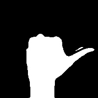
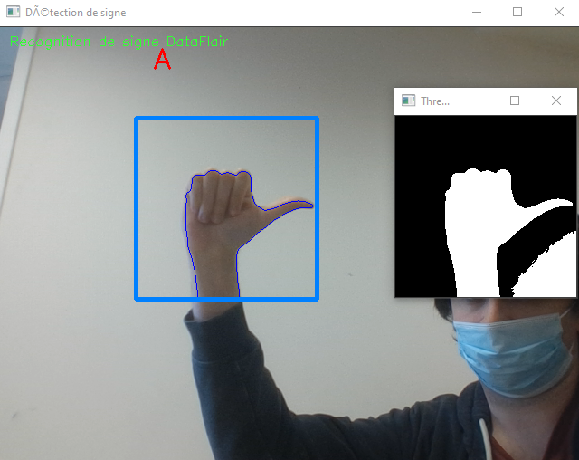
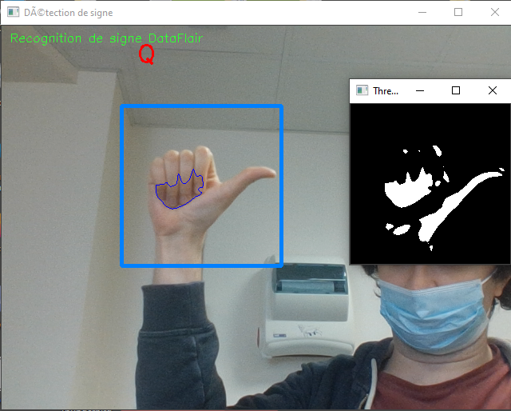

# Premier modèle

Après nous être rendu compte qu'un entraînement sur de simples images de main serait d'une précision très limitée en raison des différences d'arrière-plan, nous avons d'abord testé un modèle avec contours autour de la main.

## Création des images de départ) (BLS1_Creation_Data)

L'arrière-plan est filmé sans main pendant quelques secondes, sauvegardé, puis la main est introduite dans l'image et les différences avec l'image de départ sans main suffisent à obtenir un contour.

(Les gestes retenus pour ce modèle sont ceux de [l'alphabet LSF décrit ici](https://fr.wikipedia.org/wiki/Alphabet_dactylologique#Alphabet_de_la_Lsf). D'autres modèles peuvent présenter des différences sur certaines lettres et ne sont donc pas interchangeables.

Le Notebook est relancé pour chaque signe que l'on souhaite créer. Une ligne d'input demande à l'utilisateur de choisir l'élément (comme "A") puis la webcam filme l'arrière-plan quelques secondes avant de vérifier si une main est présente puis de prendre 100 frames.

On peut bouger un peu pour modifier l'angle, ou faire plusieurs prises, mais par défaut les images produites pour un signe seront similaires les unes aux autres. On peut en supprimer la majorité pour avoir une sélection plus petite que 100, que l'on augmentera ensuite.

## Data Augmentation et division train/test (BLS2_Data_Treatment)

Une fois tout les signes désirés produits et sauvegardés dans le dossier ``gesture``, on peut simplement lancer le deuxième Notebook pour les augmenter et les diviser puis sauvegarder en ``train`` et ``test`` dans ``data``. La data augmentation inclue une légère rotation, un pivot gauche/droite (la langue des signes pouvant apparement se faire des deux mains), un zoom ou de-zoom, un changement de luminosité, etc.

Les images de base avec leur augmentations sont sauvegardées dans ``data/train``, puis on utilise un array aléatoire pour indiquer au module ``shutil`` s'il doit les déplacer dans ``data/test``.

## Entraînement du modèle (BLS3 - Entraînement)

Le modèle est créé en utilisant ``tensorflow`` et ``keras``. Il utilise les images créées comme features et les noms de dossier (choisis pendant l'input de la première partie) comme target.

Au bout de 10 epochs, on obtient une précision d'environ 80%. Le manque de précision des images contours fait que la précision maximale possible avec ce dataset n'est sans doute pas très haute.

Le modèle est enregistré dans ``best_model_dataflair3``.

## Test du modèle (BLS4 -Test)

On charge le modèle enregistré puis on reproduit un code pour la prise webcam similaire à celui de la première partie. Seulement, une fois l'arrière-plan enregistré, un autre écran affiche les contours détectés, et le code utilise le modèle pour détecter le signe de main détecté puis affiche le résultat sur l'écran.

## Conclusion

Ce modèle basé sur les contours a un résultat respectable sur les images de test mais est bien plus inégal sur la prise webcam. Certaines lettres bien distinctes comme le L sont bien détectées, d'autres comme le R sont trop similaires à d'autres. La luminosité joue également un grand rôle et peut complètement fausser les résultats.

Exemple avec A, là où les images ont été prises :

Et dans des conditions de luminosité différentes :

Ce problème pourrait peut-être être compensé avec un plus gros dataset issues de prises à la luminosité variée. Cependant, cette méthode par contours reste limitée pour détecter les positions plus subtiles de la main.

Le modèle a aussi beaucoup de fluctuations entre les différentes lettres et n'est donc pas très adapté pour la reconstruction de mots par caméra.
